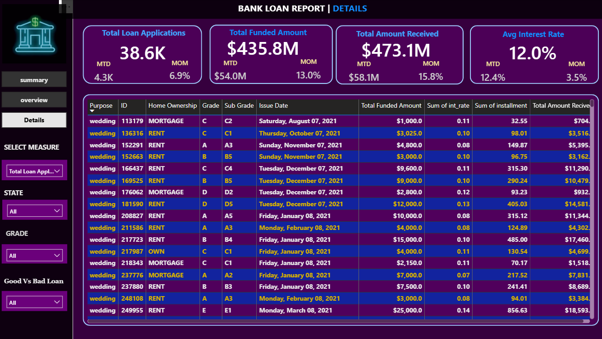

# Loan-Report
# Project Overview

This Power BI project analyzes bank loan data to provide insights into loan applications, funded amounts, repayment performance, interest rates, and loan quality.
The dashboard helps financial institutions monitor loan performance and identify good and bad loans for better decision-making.
# Dashboard Pages
1️⃣ Summary Dashboard

Total Loan Applications

Total Funded Amount

Total Amount Received

Average Interest Rate

Good Loan vs Bad Loan Analysis

Loan Status Report

MTD & MOM Analysis

2️⃣ Overview Dashboard

Monthly Loan Trends

Loan Applications by Purpose

Employee Length Analysis

Home Ownership Analysis

State-wise Loan Distribution

3️⃣ Details Dashboard

Detailed Loan-Level Records

Purpose-wise Loan Information

Grade & Sub-grade Analysis

Interest Rate & Installment Details

Interactive Filtering System

# Tools & Technologies
Power BI,
DAX,
Power Query,
Data Modeling,
Excel / CSV Dataset

# Features
Interactive Dashboard Navigation,
Dynamic KPI Cards,
MOM & MTD Analysis,
Drill-down Insights,
Slicers & Filters,
Professional UI Design,
Data-driven Business Insights.

# Business Insights
Most loans are categorized as good loans.
Fully paid loans contribute the highest received amount.
Bad loans account for a smaller percentage but involve high financial risk.
Loan trends help identify customer borrowing patterns.
Interest rate and DTI analysis help evaluate loan quality.
# Dashboard Screenshots

Summary Page

[alt text ](https://github.com/ravenakhatoon/Loan-Report/blob/main/loan%20report%20summary.png)

Overview Page

[alt text ](https://github.com/ravenakhatoon/Loan-Report/blob/main/Loan%20report%20overview.png)

Details Page

[alt text]( https://github.com/ravenakhatoon/Loan-Report/blob/main/loan%20report%20details.png)

# Business Objective
The objective of this project is to help banks and financial institutions track loan performance, identify risky loans, and make data-driven financial decisions using interactive visual analytics.
